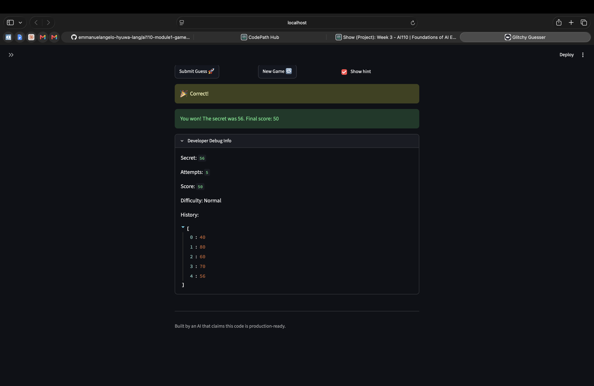

# 🎮 Game Glitch Investigator: The Impossible Guesser

## 🚨 The Situation

You asked an AI to build a simple "Number Guessing Game" using Streamlit.
It wrote the code, ran away, and now the game is unplayable. 

- You can't win.
- The hints lie to you.
- The secret number seems to have commitment issues.

## 🛠️ Setup

1. Install dependencies: `pip install -r requirements.txt`
2. Run the broken app: `python -m streamlit run app.py`

## 🕵️‍♂️ Your Mission

1. **Play the game.** Open the "Developer Debug Info" tab in the app to see the secret number. Try to win.
2. **Find the State Bug.** Why does the secret number change every time you click "Submit"? Ask ChatGPT: *"How do I keep a variable from resetting in Streamlit when I click a button?"*
3. **Fix the Logic.** The hints ("Higher/Lower") are wrong. Fix them.
4. **Refactor & Test.** - Move the logic into `logic_utils.py`.
   - Run `pytest` in your terminal.
   - Keep fixing until all tests pass!

## 📝 Document Your Experience

- [x] **Game Purpose:** Glitchy Guesser is a number guessing game where the app picks a secret number and the player tries to guess it within a limited number of attempts. Each wrong guess costs points from a starting score of 100, and the player wins by guessing the exact number before running out of attempts. The difficulty setting changes the number range and attempt limit.

- [x] **Bugs Found:**
  - Hints were backwards — "Go HIGHER" showed when the guess was too high and vice versa
  - On every even attempt, the secret was converted to a string, causing string comparisons that made hints unreliable
  - Hard difficulty had a smaller range (1–50) than Normal (1–100), the opposite of what harder should mean
  - Changing difficulty did not reset the secret number to the new range
  - New Game button only reset the secret and attempts, leaving history, status and score frozen — the game stayed stuck after a win or loss
  - The info bar hardcoded "between 1 and 100" regardless of difficulty
  - The score could randomly increase on even attempts due to a +5 bonus for "Too High" guesses
  - The debug history panel lagged one guess behind because it rendered before the submit logic ran

- [x] **Fixes Applied:**
  - Swapped the hint messages in `check_guess` in `logic_utils.py` so direction matches outcome
  - Removed the even/odd string conversion in `app.py` so guess and secret are always compared as integers
  - Changed Hard difficulty range to 1–500 in `get_range_for_difficulty` in `logic_utils.py`
  - Added difficulty-change detection in `app.py` to regenerate the secret when difficulty switches
  - Added `history`, `status` and `score` resets to the New Game block in `app.py`
  - Updated the info bar to use dynamic `low` and `high` values instead of hardcoded numbers
  - Simplified `update_score` in `logic_utils.py` to use one consistent formula (`100 - 10 × attempts`) so the score only ever decreases
  - Moved the debug expander to the bottom of `app.py` so it reflects the current guess immediately

## 📸 Demo Walkthrough

The game is a number guessing game where the app picks a secret number between 1 and 100, and you try to guess it in as few tries as possible. Your score starts at 100 and decreases with each wrong guess. Here is a full sample run from start to finish.

Starting the Game
1. User opens the app in the browser via streamlit run app.py
2. The app generates a secret number (in this example, the secret number is 56)
3. The score display shows 100 and the guess input field is ready

Making Guesses

4. User types 40 and submits
5. Game returns: "Too Low! Try a higher number."
6. Score updates to 90
7. User types 80 and submits
8. Game returns: "Too High! Try a lower number."
9. Score updates to 80
10. User types 60 and submits
11. Game returns: "Too Low! Try a higher number."
12. Score updates to 70
13. User types 70 and submits
14. Game returns: "Too High! Try a lower number."
15. Score updates to 60
16. User types 56 and submits
17. Game returns: "Correct! You guessed it!"
18. Final score of 50 is displayed on screen

**Screenshot**: <!-- Insert a screenshot of your fixed, winning game here -->

## 🧪 Test Results

```
===================== test session starts ====================
platform darwin -- Python 3.14.5, pytest-9.0.3, pluggy-1.6.0 -- /Library/Frameworks/Python.framework/Versions/3.14/bin/python3
cachedir: .pytest_cache
rootdir: /Users/kunat/Documents/CodePath/AI110/Projects/ai110-module1-gameglitchinvestigator
plugins: anyio-4.13.0
collected 6 items                                                                                                      

tests/test_game_logic.py::test_winning_guess PASSED                                                              [ 16%]
tests/test_game_logic.py::test_guess_too_high PASSED                                                             [ 33%]
tests/test_game_logic.py::test_guess_too_low PASSED                                                              [ 50%]
tests/test_game_logic.py::test_too_high_shows_go_lower PASSED                                                    [ 66%]
tests/test_game_logic.py::test_too_low_shows_go_higher PASSED                                                    [ 83%]
tests/test_game_logic.py::test_hints_consistent_across_attempts PASSED                                           [100%]

================= 6 passed in 0.01s =====================
```

## 🚀 Stretch Features

### Hot/Cold Emoji Indicators

I added a "temperature" hint system that shows the player how close their guess is to the secret number, on top of the existing Higher/Lower hint.

After `check_guess` returns in `app.py` (inside the `if submit:` block), the distance between the guess and the secret is calculated and displayed:

- 🔥 **Hot**: guess is within 10 of the secret
- 🌡️ **Warm**: guess is within 25 of the secret
- ❄️ **Cold**: guess is more than 25 away

This only runs when "Show hint" is enabled and only for non-winning guesses. No changes were made to `logic_utils.py` — it is purely a UI addition in `app.py`.
